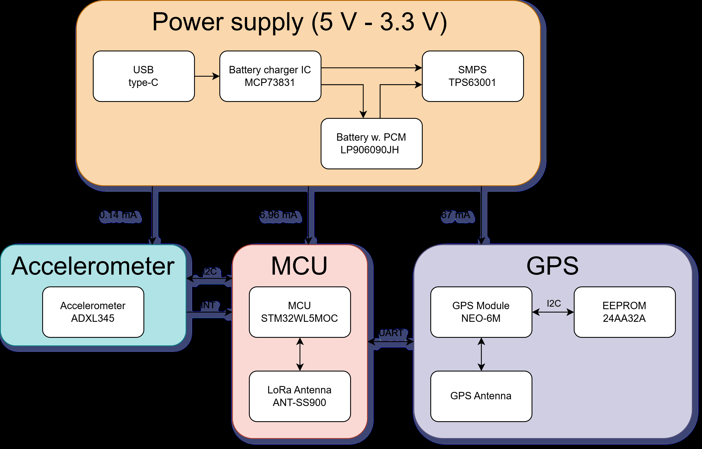
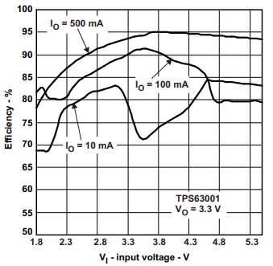
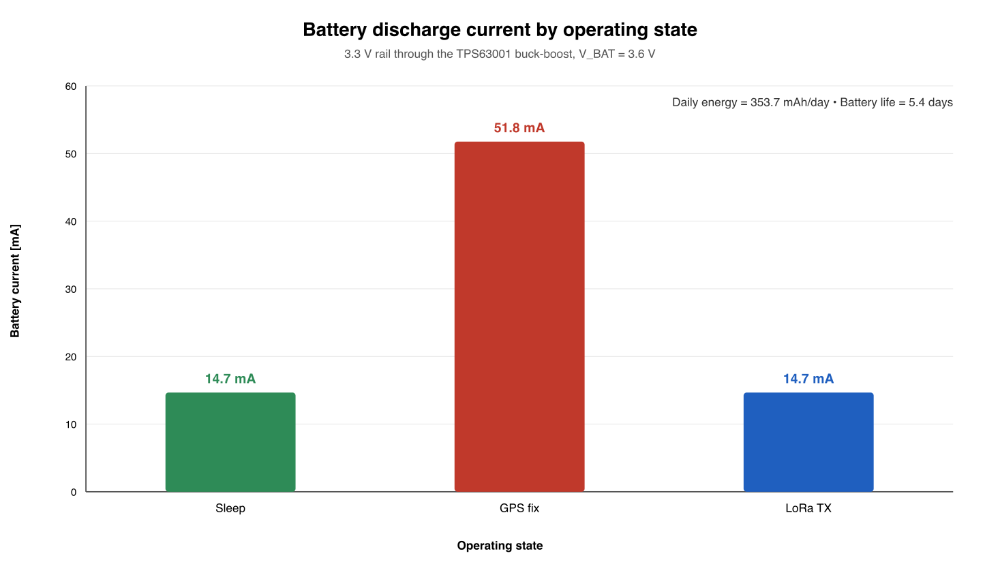
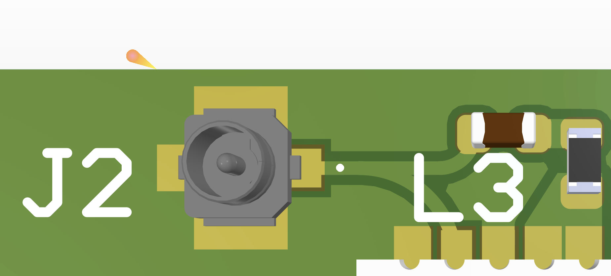
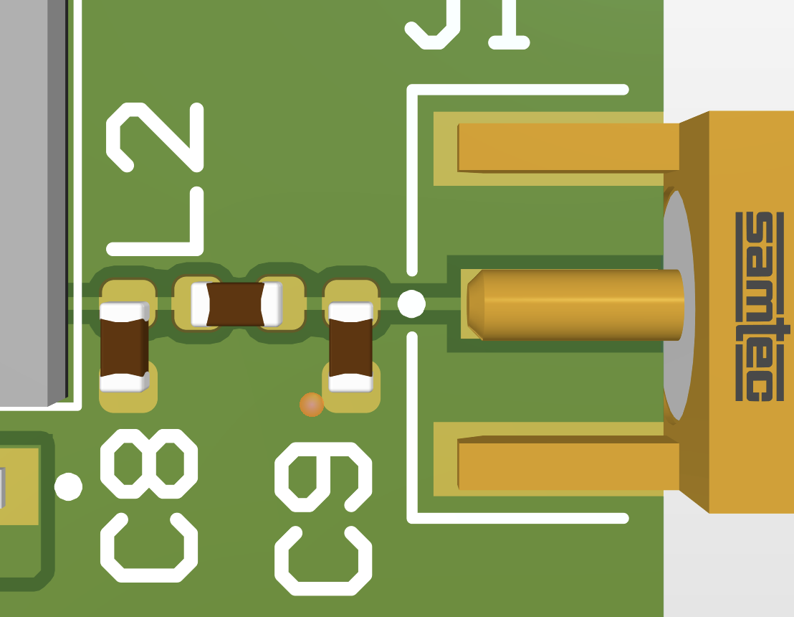
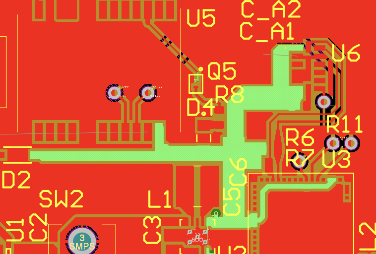

# System design — Smart Bike Theft Tracker

Design rationale for the GPS + LoRaWAN ultra-low-power bike theft tracker.
Numbers match the design report and the scripts in `analysis/`.

---

## 1. Requirements

| # | Requirement | Implementation |
|---|---|---|
| 1 | Motion detection that can wake the MCU from deep sleep | **ADXL345** activity interrupt → MCU `WKUP1`/`PA0` |
| 2 | ARMED / DISARMED user control | 2-position **slide switch** on an MCU GPIO |
| 3 | Acquire position | **u-blox NEO-6M** GPS over UART + antenna |
| 4 | Transmit alert + coordinates | **STM32WL5M** integrated LoRaWAN + SMA antenna |
| 5 | Battery-powered with charger and regulation | USB-C → **MCP73831** → 1900 mAh LiPo → **TPS63001** 3.3 V |
| 6 | 50 Ω controlled-impedance RF feeds and antenna placement | Coplanar waveguide with ground on a 4-layer stack |

The brief is **design & analysis only** — no fabrication, purchasing or assembly.

---

## 2. System architecture

The device is organised into four functional blocks that mirror the schematic
hierarchy:

| Sheet | Block | Key parts |
|---|---|---|
| `Top.SchDoc` | Hierarchy | sheet symbols `U_GPS`, `U_GyroSense`, `U_MCU`, `U_BatteryCharger` |
| `BatteryCharger.SchDoc` | Power | MCP73831 charger, TPS63001 buck-boost, USB-C, JST, slide switch |
| `MCU.SchDoc` | Compute + radio | STM32WL5MOCH6TR, LoRa SMA connector, decoupling |
| `GyroSense.SchDoc` | Motion | ADXL345, I²C pull-up, decoupling |
| `GPS.SchDoc` | Positioning | NEO-6M, U.FL antenna, backup cell, power gating |

Data flows: the accelerometer raises an interrupt, the MCU reads it over I²C,
checks the slide-switch state, powers up the GPS, reads NMEA over UART and then
transmits the fix over the integrated LoRaWAN radio.

### Firmware / operation flow

1. **SLEEP** — ARMED, no movement. MCU in standby (`125 nA`), GPS in power-save
   with its backup domain alive, accelerometer at a low ODR only for interrupts.
2. **Motion interrupt** — the ADXL345 pulls the wake pin; the MCU wakes and
   checks the slide switch. If DISARMED it ignores the event and returns to
   standby.
3. **GPS FIX** — the MCU enables the GPS rail (via the load MOSFET) and reads
   NMEA over UART. A hot start is assumed because the backup cell keeps the
   ephemeris.
4. **LoRa TX** — the coordinates are sent as a LoRaWAN alert; the system then
   returns to sleep.

---

## 3. Component choices

### MCU + LoRaWAN — STM32WL5MOCH6TR
- Dual-core Cortex-M4 (application) + Cortex-M0+ (radio), with the **SX126x
  LoRa radio integrated in-package**.
- Integrated oscillator network and antenna matching/PA network — **no external
  crystals or discrete matching** required, which shrinks the PCB and removes RF
  layout risk.
- I²C, SPI, UART, ADC and interrupt-capable wake pins, with a very low standby
  current. The trade-off is cost (≈ €12.43 vs €5–10 for similar STM32s), which is
  outweighed by reduced complexity, size and STM's documentation/support.

### Accelerometer — ADXL345BCCZ-RL7
- 3-axis, I²C/SPI, 3 mm × 5 mm package, FIFO and built-in **activity / tap /
  inactivity / free-fall** detection.
- Its interrupt output connects to `WKUP1` (`PA0`) so the sensor can wake the
  system directly from deep sleep — no polling, which is what makes the
  low-power budget possible.

### GPS — u-blox NEO-6M-0-001
- Self-contained receiver with a **simple UART** interface (default 9600 bps
  NMEA), 16 mm × 12.2 mm × 2.4 mm, 2.7–3.6 V.
- Drawback: the NEO-6 family is **End-of-Life**; acceptable here because the
  module removes navigation processing from the host and is easy to power-gate.
- A **backup coin cell** (retainer + Schottky `STPS0540Z`) keeps the RTC and
  ephemeris alive so the theft fix can be a **hot start**.

### Charger — MCP73831T-2ACI/OT + Jauch LP605060JU
- 4.2 V single-cell Li-Ion/LiPo charger, programmable current, status output.
- Battery: **Jauch LP605060JU, 1900 mAh**, with an integrated **protection
  circuit module (PCM)** — this is the stated battery-protection assumption.
- USB-C input (`USB4125-GF-A-0190`) with 5.1 kΩ CC pull-downs.

### Regulator — TPS63001 (chosen over an LDO)
See §4.

---

## 4. Power design: LDO vs buck-boost

An **MCP1700 LDO** was compared against the **TPS63001 buck-boost** for the
3.3 V rail at the 74 mA peak load.

| Criterion | MCP1700 (LDO) | TPS63001 (buck-boost) |
|---|---|---|
| Minimum input | 3.3 V·1.03 + 0.35 V = **3.749 V** | **1.8 V** |
| Loss at peak load | 33.2 mW | 27.1 mW (η ≈ 90 %) |
| Quiescent current | **4 µA** | 51.5 µA |
| Complexity | 2 capacitors | inductor + more passives |

The LDO wins on quiescent current and simplicity, but its **minimum input of
3.75 V is above the usable voltage of a LiPo cell** (which falls to ~3.0 V). It
therefore cannot regulate across the whole discharge curve, while the
buck-boost both keeps 3.3 V down to 1.8 V in and is slightly more efficient.
The **TPS63001** was selected on that basis:

$$
P_{out}=3.3\,\text{V}\times74\,\text{mA}=244.2\,\text{mW},\qquad
I_{in}=\frac{244.2\,\text{mW}}{0.8\times3.0\,\text{V}}=101.8\,\text{mA}
$$

which is well within the cell's 0.2 C (≈380 mA) discharge rating.

---

## 5. Power budget & battery life

Three states are defined; each component's current draw comes from its
datasheet, and the SMPS efficiency converts the 3.3 V load into battery current:

$$
I_{bat}=\frac{V_{rail}\cdot I_{out}}{\eta\cdot V_{bat}}
$$

| Component | Sleep | GPS fix | LoRa TX |
|---|---:|---:|---:|
| MCU | 125 nA | 1.1 mA | 1.1 mA |
| GPS | 11 mA | 47 mA | 11 mA |
| Backup battery | 879 µA | 0 mA | 0 mA |
| Accelerometer | 30 µA | 30 µA | 30 µA |
| **SMPS output** | 12 mA | 48 mA | 12 mA |
| **Battery discharge** | **14.7 mA** | **51.8 mA** | **14.7 mA** |

Daily energy (one 1-minute hot-start fix per day):

$$
14.7\,\text{mA}\times24\,\text{h}+51.8\,\text{mA}\times\tfrac{1}{60}\,\text{h}
=353.7\ \tfrac{\text{mAh}}{\text{day}}
$$

$$
\text{Battery life}=\frac{1900\,\text{mAh}}{353.7\,\text{mAh/day}}
=5.4\ \text{days (worst case)}
$$

In practice the GPS only needs a fix at an alert, so the tracker only needs
charging about **once a week**.

---

## 6. RF & PCB layout

The board is a **4-layer FR-4** stack. Both antenna feeds are **50 Ω
controlled-impedance coplanar waveguides with ground**, with **via stitching**
to confine the field and stabilise the impedance.

RF rules applied:

- **LoRa:** straight feed to the edge-mounted SMA (`SMA-J-P-H-ST-EM1`) for the
  `ANT-SS900` antenna, at 868/915 MHz.
- **GPS:** short, **curved** trace to the `A-1JB` U.FL connector at 1575.42 MHz;
  arcs are preferred over 90° corners to avoid impedance perturbations.
- **Continuous reference plane** under every RF trace — no splits, since a
  discontinuity in the return path degrades the effective impedance.
- **Direct ground connections** (no thermal spokes) on RF ground pads, because
  spokes add inductance at RF.
- **No layer transitions** on the feeds — vias would add parasitic inductance
  and reflections.

### Power distribution

The 3.3 V rail is distributed **star-style** directly from the buck-boost
rather than daisy-chained, so transient current from one block does not create
a supply dip at another:

---

## 7. Assumptions & limitations

- Analysis only: no board was fabricated, so all currents/efficiency figures
  are datasheet- or simulation-based.
- GPS fix time assumed to be **1 minute** (datasheet hot start ≈ 15 s) as a
  conservative margin.
- SMPS efficiencies assumed 75 % (light load) / 85–90 % (heavy load) from the
  datasheet curves.
- The `NEO-6M` is End-of-Life; a production revision would move to a current
  u-blox module.
- Battery protection is credited to the cell's integrated PCM.
- The slide switch is a proof of concept for ARM/DISARM; the report notes NFC
  as a more realistic product-grade alternative.
